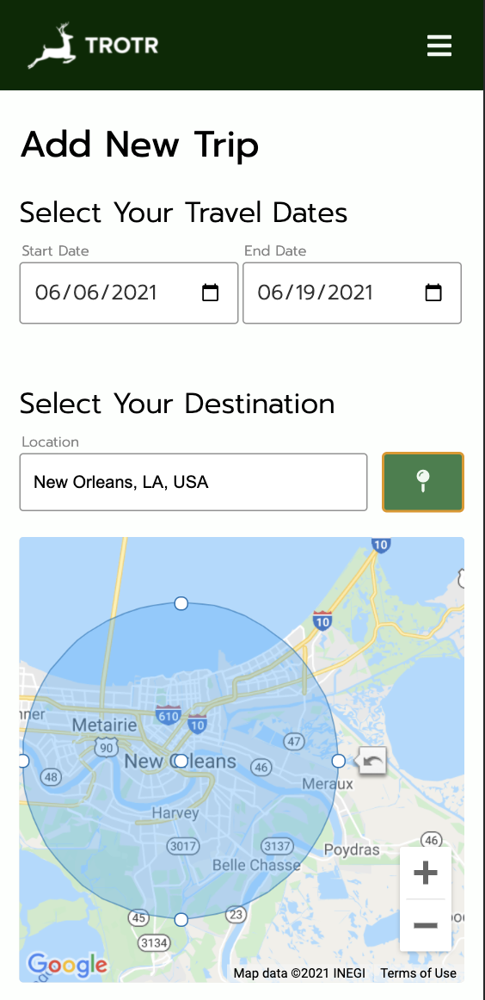
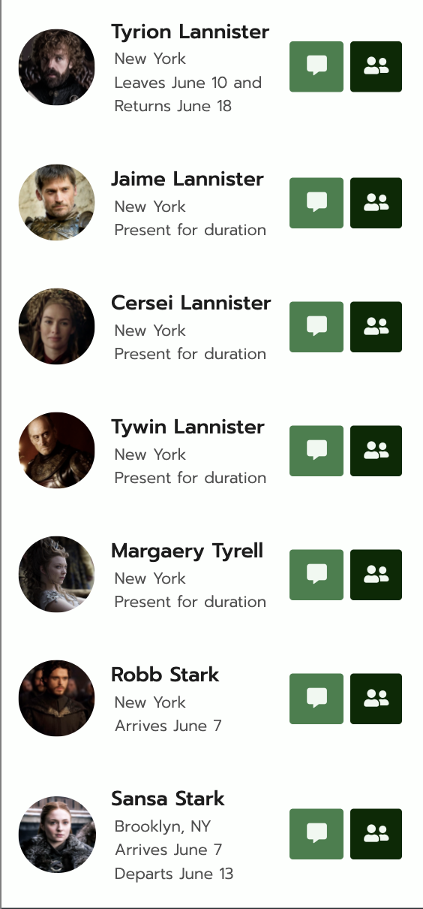

# Trotr

## Social location sharing prototype

Trotr is a prototype with a basic feature-set to share region-level location with friends. It addresses the use case of connecting with friends while travelling (e.g. "When I go to New Orleans in two weeks, who do I know that will be there at the same time").

## Technologies Used
 - HTML 5
 - Javascript / jQuery
 - CSS
 - Google APIs ([Places](https://developers.google.com/maps/documentation/places/web-service/overview), [Maps Javascript](https://developers.google.com/maps/documentation/javascript/overview), and [Geocoding](https://developers.google.com/maps/documentation/geocoding/overview))

## Getting Started

To demo the functionality of the app, set a trip starting June 1st and ending June 6th to New York City (use the default "social fence" at first). You'll see all the contacts who either live in or will travel to New York if their dates overlap with yours. 

To demo other list outcomes:
 - Change the "social fence" to include Queens
 - Change the end date to June 9th, June 12th, and June 20th

## Screenshots

## Future Features

 - See trips and domestic breakdowns as a single timeline
 - Message friends through app and see content as SMS
 - Coordinate availability for event planning with friends
 - "Happening Now" feature to see what friends in your area have publicly shared
 - WebGL for 3D map views